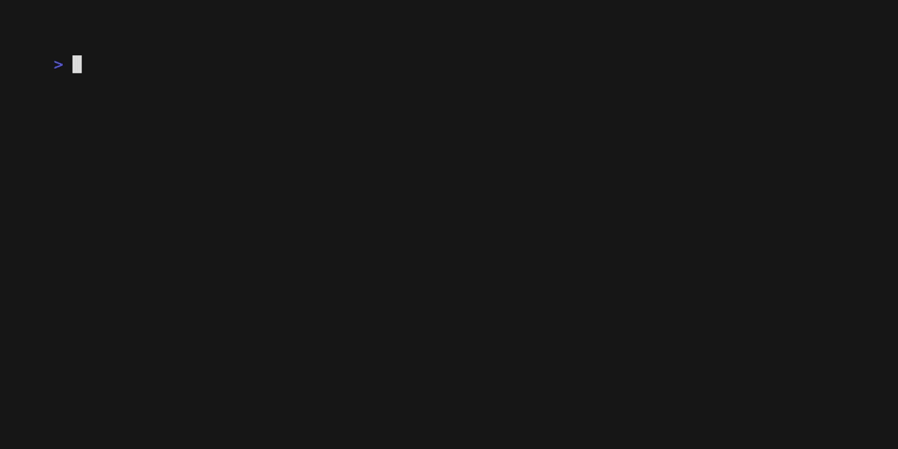

# Preflight 🛫

> Automate your tooling checklist with Preflight


[](./LICENSE)

Preflight will run a list of commands for you to make sure that you are ready to go on your journey. This can be usefull when you are reinstalling your computer and are used to some configuration, or to make sure that the onboarding in a new team is complete.  



## Install ⬇️

For now, simply download [preflight](./preflight) and run it. More options will come 💪

## Usage 🚀

```
preflight path/to/yaml/descriptor
```

The `path/to/yaml/descriptor` is a `YAML` file with a list of *System Checks*. You can find an exemple in [checklists/demo.yaml](./checklists/demo.yaml). Feel free to download and edit it to fit your needs, it showcases every possibilities.

### How to write a checklist 👨‍✈

Firstly, remember that this is check-**list**. The top level object is a **list**. Each entry is called a `SystemCheck`:

| Key         |      Type      | Mandatory | Description |
| :---------- | :------------: | :-------: | :---------- |
| name        |    `string`    |    yes    |  Name of the category of commands | 
| description |    `string`    |    no     |  Explain why this check is being made. (Ex: you should be able to manage different node versions). |
| optional    |   `boolean`    |    no     | Default to `false`. If set to true, can fail. It will still display the verose message |  
| checkpoints     | `[]Checkpoint` |    yes    | The list of options. At least *one* should pass to make the SystemCheck green |

And each `Checkpoint` is defined as follow:
| Key           |      Type      | Mandatory | Description |
| :------------ | :------------: | :-------: | :---------- |
| name          |    `string`    |    yes    |  Name of the command / label to display | 
| command       |    `string`    |    yes    |  the actual command passed to the runner. By default, preflight will only assert if the command exist on your machine. |
| live_run      |   `boolean`    |    no     | Default to `false`. Usefull when you want to actually run the command, not only check if it exists, or if the result depend of a prompt. |  
| documentation |    `string`    |    yes    |  In case of failure, display some info to the user about what to do next. This should at least be a link to the documentation on how to install said command. |

## Roadmap 🚦

- [x] File based decriptor  
- [ ] Make it installable seamlessly
- [ ] Add flag-based descriptor for major use-cases. Go fileless  
    Currently supported Systems:
    - Missing some config ? Feel free to [open an issue](https://github.com/Delni/preflight/issues/new) to discuss it !

## How to contribute 📝

➡️ See [CONTRIBUTING](./CONTRIBUTING.md) 